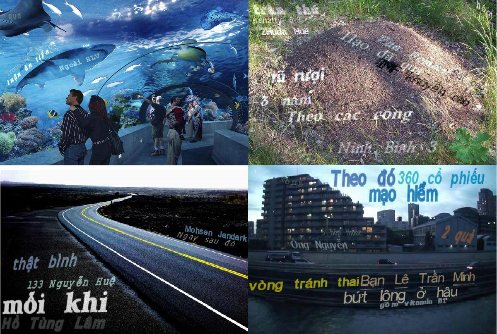
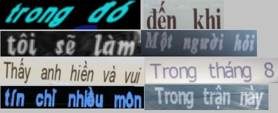

This repositories was edited form E2E-MLT repositories of MichalBusta

# E2E-MLT

 an Unconstrained End-to-End Method for Multi-Language Scene Text
code base for:  https://arxiv.org/abs/1801.09919

```
@@inproceedings{buvsta2018e2e,
  title={E2E-MLT-an unconstrained end-to-end method for multi-language scene text},
  author={Bu{\v{s}}ta, Michal and Patel, Yash and Matas, Jiri},
  booktitle={Asian Conference on Computer Vision},
  pages={127--143},
  year={2018},
  organization={Springer}
}
```


## Requirements

  - python3.x with
  - opencv-python
  - torchvision


## Data

 - [SynthText - Vietnamese generator](https://github.com/nhh1501/SynthText-vietnamese) (Dataset for Text Localization and Text Recognition)
 - [Text Recognize generator](https://github.com/Belval/TextRecognitionDataGenerator)  (Dataset for Text Recognition)
 
 
 
 
 
 I used the generators above to generate the Vietnamese language for this task


## Acknowledgments

 Code borrows from [EAST](https://github.com/argman/EAST) and [DeepTextSpotter](https://github.com/MichalBusta/DeepTextSpotter)
 
